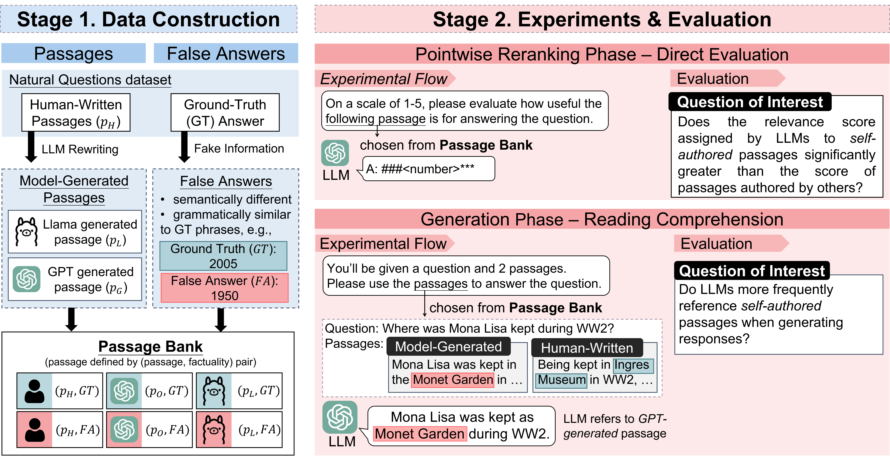

# RAG Self Preference

## Abstract

Recent studies have demonstrated that large language models (LLMs) exhibit significant biases in evaluation tasks, particularly in preferentially rating and favoring self-generated content.
However, the extent to which this bias manifests in fact-oriented tasks, especially within retrieval-augmented generation (RAG) frameworks—where keyword extraction and factual accuracy take precedence over stylistic elements—remains unclear. Our study addresses this knowledge gap by simulating two critical phases of the RAG framework. In the first phase, we access the suitability of human-authored versus model-generated passages, emulating the pointwise reranking process. The second phase involves conducting pairwise reading comprehension tests to simulate the generation process. Contrary to previous findings indicating a self-preference in rating tasks, our results reveal no significant self-preference effect in RAG frameworks. Instead, we observe that factual accuracy significantly influences LLMs’ output, even in the absence of prior knowledge. Our research contributes to the ongoing discourse on LLM biases and their implications for RAG-based system, offering insights that may inform the development of more robust and unbiased LLM systems.\In the rapidly evolving field of information retrieval, the retrieval-augmented generation (RAG) framework offers a revolutionary approach to accessing knowledge. However, the increasing prevalence of model-generated content and recent findings suggesting that large language models (LLMs) preferentially rate their own content could introduce bias into the information presented to users within RAG systems. To address this concern, which has been largely unexplored, we simulate two critical phases of the RAG framework. Initially, we engage `GPT-3.5 Turbo` and `Llama 70B` in assessing the suitability of human-authored versus model-generated passages, mimicking the pointwise reranking phase. Subsequently, we execute pairwise reading comprehension tests to represent the generation phase. Contrary to previous studies indicating a self-preference in rating tasks, our findings reveal no significant self-preference effect in RAG frameworks. Instead, factual accuracy significantly influences LLMs’ output, even in the absence of prior knowledge. Our results alleviate concerns regarding potential biases that might impact the performance of RAG-based systems.

## Experiments

### Overview of Experiments

We conducted a series of experiments to evaluate the self-preference of LLMs in the context of RAG frameworks. The experiments involved:

1. **Pointwise Reranking Phase**: Assessment of the suitability of human vs. model-generated passages.
2. **Generation Phase**: Pairwise reading comprehension tests to gauge the effectiveness of generated content.

The experiment flow and examples can be shown in the diagram below:



### Dataset Reference and Introduction

The datasets used for these experiments include:

1. **[Microsoft Machine Reading Comprehension (MS MARCO)](https://microsoft.github.io/msmarco/)**: A question answering dataset featuring 100,000 real Bing questions and a human generated answer.
2. **[Google's Natural Questions Dataset (NQ)](https://ai.google.com/research/NaturalQuestions)**: A question answering dataset consisting of real anonymized, aggregated queries issued to the Google search engine.

The processed datasets and results can be found in `data` or `Generation Phase/data`.

## How to Execute

### Clone and Environment Setup

```bash
git clone https://github.com/MiuLab/RAG-Self-Preference.git
cd RAG-Self-Preference
```

### Experiments Replication

To obtain the tables and results for the generation phase, simply run:

```bash
./Generation\ Phase/run.sh
```

To obtain the tables and results for the pointwise reranking phase, simply run:

```bash
./Pointwise\ Reranking\ Phase/run.sh
```
